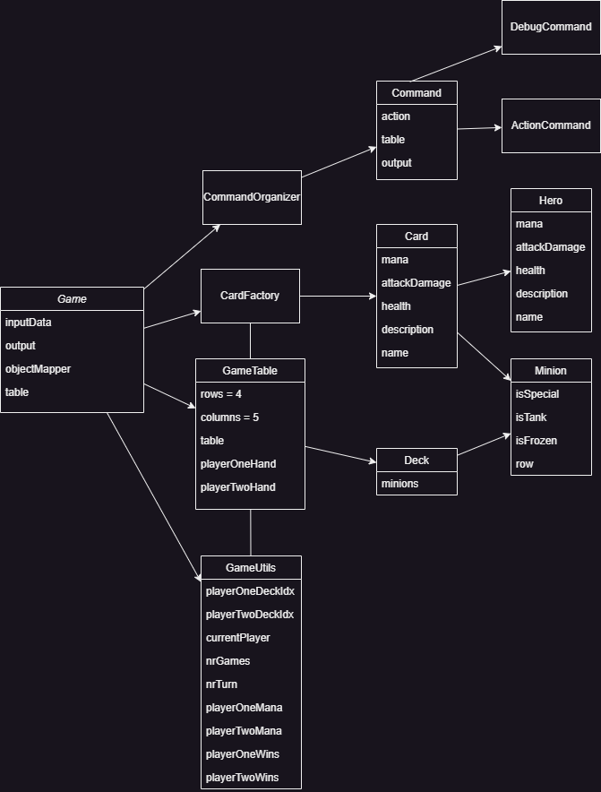

# Gwentstone
## Game Rules

The game is a 1v1 card game where each player has a shuffled deck of cards.

### Game Flow
- The game is played in rounds, where each player plays a card from their hand.
- At the beginning of each round:
    - Each player draws a card from their deck to their hand.
    - Each player receives mana (1st round adds 1 mana, 2nd round adds 2 mana, etc. until 10 mana).

### Card Types
- There are 2 types of cards: minions and heroes.
- Each card has a mana cost, and the player can only play cards that they can afford.
- Each card has an attack and health value.

### Hero
- The hero is received at the beginning of the game.
- Hero stats:
    - Health: 30
    - Attack: 0

### Minions
- Minions are played on the board and can attack the opponent's hero or other minions.
- Minions can only attack once per turn.
- Minions can attack the opponent's hero if there are no minions in the front line (Tanks).

### Winning the Game
- The game ends when a player's hero has 0 health.
- The player with the hero still alive wins the game.

### Commands
- `placeCard <handIdx>`: Play a card from the player's hand.
- `cardUsesAttack <cardAttacker> <cardAttacked>` : The cardAttacker attacks the cardAttacked.
- `cardUsesAbility <cardAttacker> <cardAttacked>` : The cardAttacker uses its ability on the cardAttacked.
- `useAttackHero <cardAttacker>` : The cardAttacker attacks the opponent's hero.
- `useHeroAbility <affectedRow>`: The hero uses its ability on the affectedRow.
- `endTurn`: End the player's turn.
- `getCardsInHand <playerIdx>`: Print the cards in the player's hand.
- `getPlayerDeck <playerIdx>`: Print the cards in the player's deck.
- `getCardsOnTable`: Print the cards on the table.
- `getPlayerTurn` : Print which player's turn it is.
- `getPlayerHero <playerIdx>`: Print the player's hero.
- `getCardAtPosition <x> <y>`: Print the card at the position (x, y) on the game table.
- `getPlayerMana <playerIdx>`: Print the player's mana.
- `getFrozenCardsOnTable`: Print the frozen cards on the table.
- `getTotalGamesPlayed`: Print the total number of games played.
- `getPlayerOneWins` / `getPlayerTwoWins` : Print how many games player one / two has won.

## Class Diagram

### Design Pattern and Commands
- I used the Singleton pattern for handling the commands.
The `CommandContext` class uses the Singleton pattern to ensure that there is only one instance
of the class, provides a global point of access to it and prevents conflicts.
- There are two types of commands: `DebugCommand` and `ActionCommand`.
Each of them has static methods that are called by the `CommandOrganizer` class.
- The `CommandConext` class encapsulates the attributes of a command: action, table and output.

### Creating cards
- The `Card` class is the parent class of `Minion` and `Hero`.
- Cards are created in the CardFactory class using **Upcasting**.
- The CardFactory class is called from the Game class to create Heros using **Downcasting** and
from the Deck class to create Minions, since a deck can only have minions.
- Classes `Minion` and `Hero` have multiple child classes that inherit from them, each with
specific attributes.
